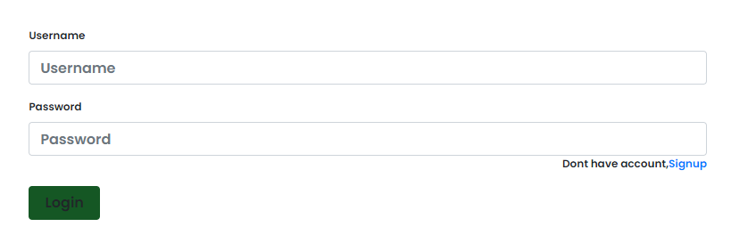
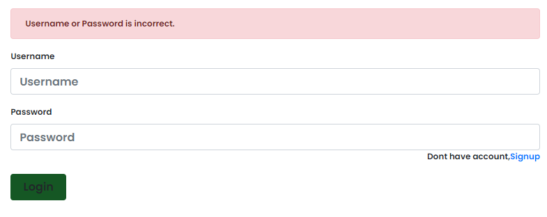
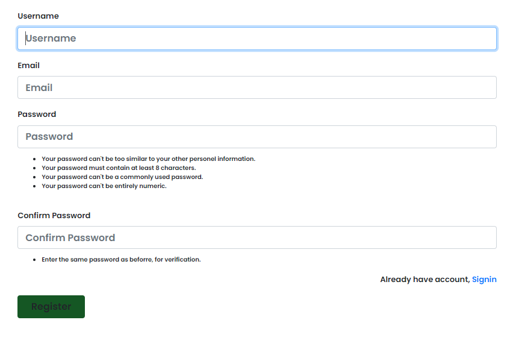
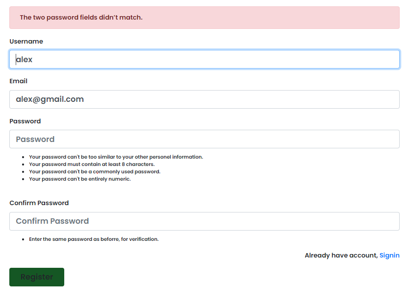
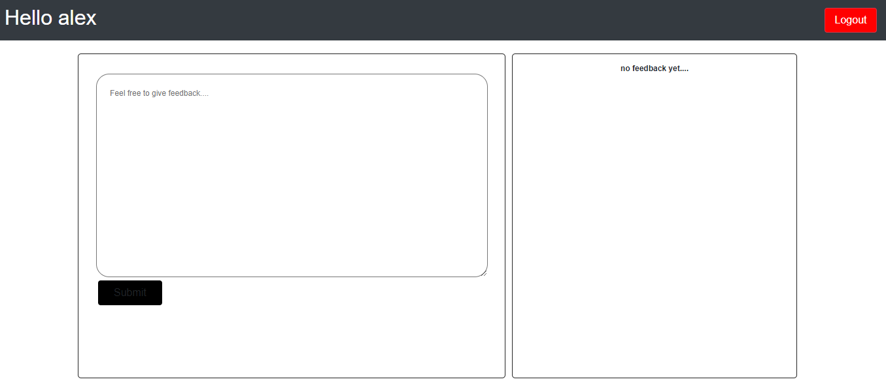

<h1>Form Authentication </h1>

<i>(This project is made using Django as an backend language.)</i>

It consists of login page for the user that already exist in the system whereas for new user it provides signup.

Initially when entering the site, it automatically redirects to login page.

While login; if given a wrong credentials like wrong username or password, it shows error.

For signup, just click the signup hyperlink in login page and it redirects to the signup page.

Similar to the error message shown in login page, the signup page shows the same: the email field must include '@' character, and the password field and confirm password field must be same.

On successfull signup, it redirects to login page showing "account creation" message and on logging in - redirects to the inner page linked to successfull login.

To run this app - open terminal, direct to the repository consisting *manage.py* file and run the server using code *python manage.py runserver*

*(Note: all the requirements/packages needed must be fulfilled.)*